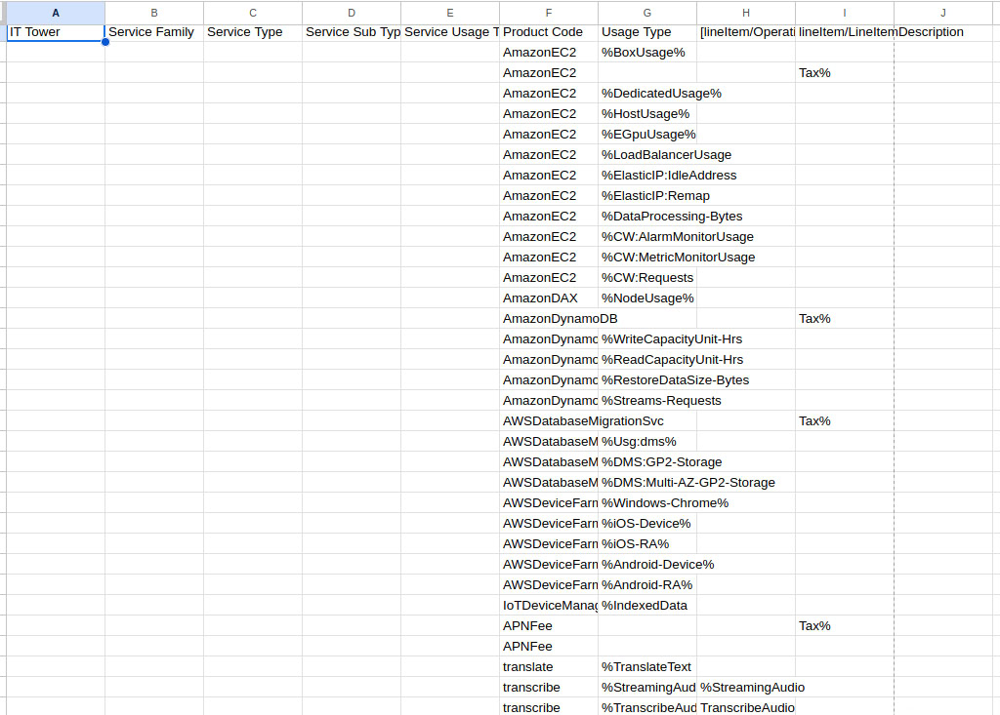
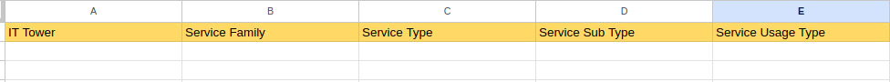
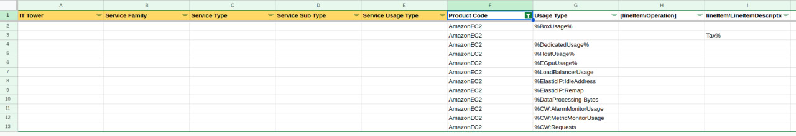
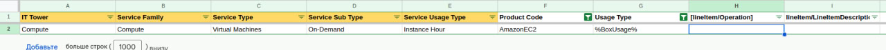
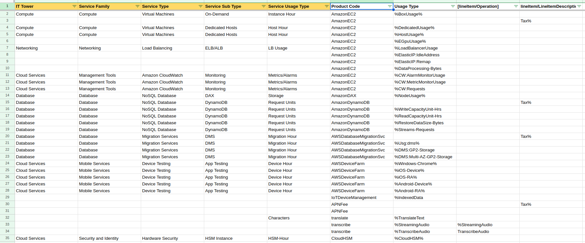
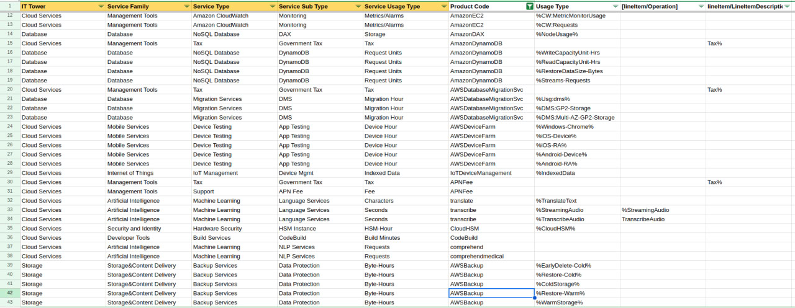
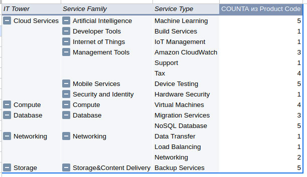

Отчет по лабораторной работе №1
## Тема: «Знакомство с IaaS, PaaS, SaaS сервисами в облаке на примере Amazon Web Services (AWS). Создание сервисной модели»

**Студенты:** Борисюк Евгений, Езиева Милана, Муравьём Матвей   

---

### 1. Введение и постановка задачи
**Цель работы:** Приобретение практических навыков анализа структуры публичных облачных сервисов, понимание уровней абстракции над инфраструктурой и формирование комплексной сервисной модели без привязки к конкретному вендору.

**Основные задачи:**
1. Технически корректный импорт данных биллинга AWS из формата CSV.
2. Проектирование иерархической системы классификации (таксономии).
3. Сопоставление технических параметров использования с разработанными аналитическими категориями.
4. Построение сводной модели для анализа потребления ресурсов «от большего к меньшему».

---

### 2. Этап 1: Импорт и первичная обработка данных
В качестве исходных данных использовался файл `Mapping Rules AWS team 2.csv`, содержащий параметры биллинга (Product Code, Usage Type и др.). Импорт осуществлялся в среду Google Sheets. 

Для корректного распределения данных по столбцам был использован тип разделителя «Другой» (Custom) со значением точки с запятой (`;`). Также была активирована функция автоматического преобразования текста в числа и формулы для обеспечения корректности будущих расчетов.

> **Рисунок 1: Параметры импорта CSV-файла с использованием разделителя «;»**
> 

После завершения импорта была сформирована табличная структура. Технические данные провайдера заняли колонки с F по J. Колонки с A по E были подготовлены для заполнения уровней аналитической иерархии.

> **Рисунок 2: Структура таблицы после импорта данных**
> 

---

### 3. Этап 2: Проектирование таксономии сервисной модели
Согласно требованиям лабораторной работы, была разработана пятиуровневая система классификации. Она позволяет структурировать облачные затраты от глобальных доменов до конкретных единиц тарификации.

**Выбранные уровни иерархии:**
1. **IT Tower:** Глобальная «башня» ИТ (например, Compute, Storage, Networking).
2. **Service Family:** Технологическое семейство (например, Virtual Machines, Databases).
3. **Service Type:** Конкретный программный продукт или сервис.
4. **Service Sub Type:** Подтип использования (например, On-Demand, Dedicated).
5. **Service Usage Type:** Конкретная метрика потребления (часы инстанса, байт-часы).

Для удобства навигации по справочнику первая строка с названиями категорий была закреплена и выделена цветовой индикацией.

> **Рисунок 3: Оформление заголовков иерархической модели**
> 

---

### 4. Этап 3: Процесс сопоставления данных (Mapping)
Для заполнения классификатора использовался метод системного маппинга. Основным инструментом автоматизации послужил механизм фильтрации Google Sheets. Это позволило группировать однотипные продукты (Product Code) и массово присваивать им соответствующие уровни иерархии, минимизируя риск ошибок ручного ввода.

> **Рисунок 4: Использование фильтрации по колонке Product Code для массовой обработки**
> 

При классификации ресурсов учитывались SQL-маски (символ `%`), указанные в условиях. Особое внимание уделялось разделению сервиса `AmazonEC2`: на основе анализа поля `Usage Type` ресурсы распределялись между вычислительными мощностями (`Compute`) и сетевой инфраструктурой (`Networking`).

> **Рисунок 5: Начало процесса заполнения иерархии для базовых вычислительных мощностей (EC2)**
> 

В ходе работы была проведена последовательная обработка всех групп сервисов, представленных в биллинге. Модель охватила не только основные ресурсы (виртуальные машины, базы данных), но и вспомогательные услуги, такие как мониторинг и инструменты управления.

> **Рисунок 6: Фрагмент сформированного справочника соответствий для первой группы ресурсов**
> 

---

### 5. Этап 4: Обеспечение полноты данных и верификация маппинга
После первичного распределения базовых ресурсов была проведена работа по заполнению специфических и высокоуровневых сервисов, представленных в биллинге (IoT, AI/ML, Backup). 

Особое внимание было уделено консистентности названий: одна и та же категория (например, `Database`) должна была иметь идентичное написание во всех строках для корректной работы последующей агрегации. Также в модель были включены статьи расходов, не относящиеся напрямую к вычислительным мощностям, такие как государственные налоги (`Tax`) и партнерские сборы (`APN Fee`), которые были классифицированы как `Management Tools`.

> **Рисунок 7: Полностью сформированный справочник маппинга для всех сервисов Team 2**
> 

Итогом данного этапа стала база данных, в которой каждая техническая запись провайдера (колонки F-J) получила однозначное соответствие в пятиуровневой бизнес-иерархии (колонки A-E).

---

### 6. Этап 5: Построение иерархической аналитической модели
Для выполнения требования по анализу потребления ресурсов «от большего к меньшему» был использован механизм сводных таблиц (Pivot Tables). Это позволило агрегировать сотни технических правил в единую древовидную структуру.

Настройка сводной таблицы производилась в два подэтапа:
1.  **Определение строк (Rows):** Были добавлены уровни `IT Tower`, `Service Family` и `Service Type`. Порядок добавления определил вложенность модели.
2.  **Определение значений (Values):** Использован подсчет количества вхождений (`COUNTA`) по полю `Product Code` для верификации полноты покрытия справочника.

> **Рисунок 8: Техническая настройка иерархии строк в сводной таблице**
> 
> **Рисунок 9: Настройка расчетных значений сводной модели**
> 

---

### 7. Анализ финального результата
Итоговая сводная таблица представляет собой интерактивную модель, визуализирующую «облачное дерево» ресурсов. Каждая «башня» (IT Tower) раскрывается до конкретных технологических семейств и продуктов.

Например, сегмент `Compute` включает в себя виртуальные машины, сегмент `Database` разделен на миграционные сервисы и NoSQL-решения, а сегмент `Networking` объединяет балансировщики нагрузки и инструменты передачи данных.

> **Рисунок 10: Финальная иерархическая модель облачных сервисов AWS**
> 
---

### 8. Заключение
В ходе выполнения лабораторной работы №1 была успешно спроектирована и реализована сервисная модель для облака AWS. 

**Ключевые результаты:**
*   Освоена методика импорта и парсинга неструктурированных данных биллинга.
*   Создана универсальная пятиуровневая таксономия, применимая к любому облачному провайдеру.
*   Настроена система маппинга, автоматизирующая классификацию ресурсов через фильтры и регулярные выражения (маски %).
*   Построена иерархическая модель, обеспечивающая прозрачность затрат и готовность к кросс-провайдерному сравнению с Microsoft Azure в рамках следующего этапа обучения.

Работа подтвердила, что корректная настройка конфигурации и иерархии является критически важным навыком DevOps-инженера для эффективного управления облачной инфраструктурой.

