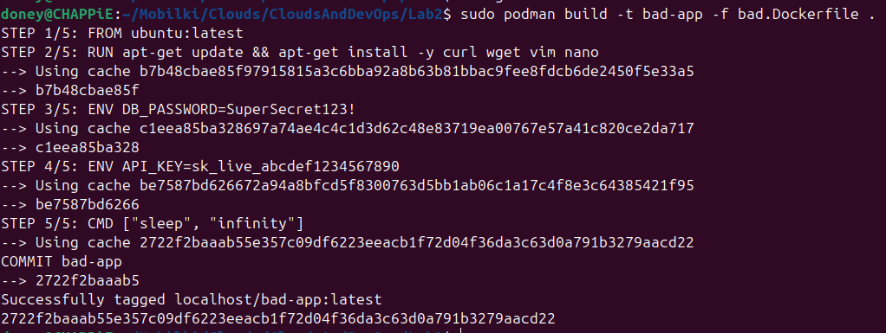
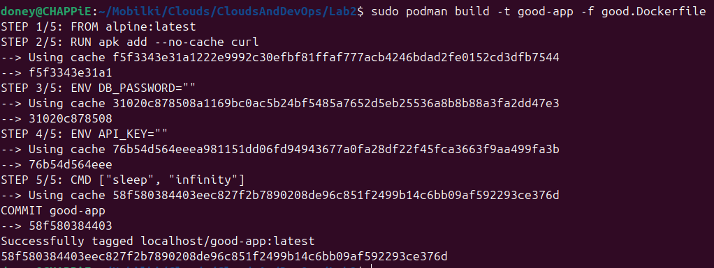
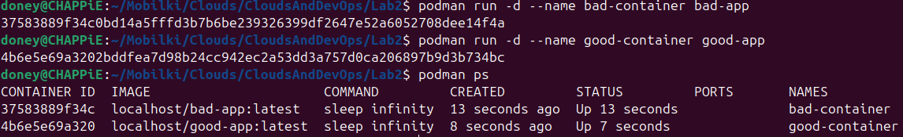
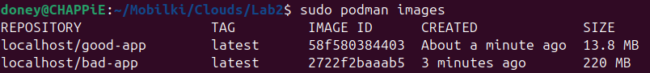
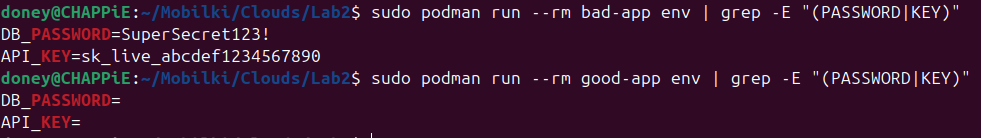
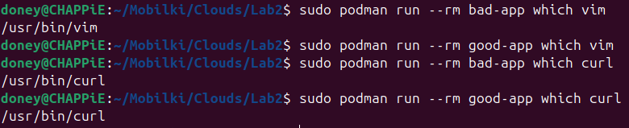
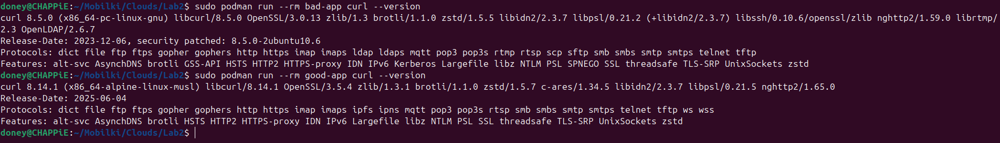

# Лабораторная работа №2: 


## Цель работы

Научиться выявлять и исправлять распространенные ошибки в Dockerfile, освоить best practices создания контейнерных образов с использованием Podman.

## Анализ плохих практик в Dockerfile

### Исходный "плохой" Dockerfile

```dockerfile
FROM ubuntu:latest

RUN apt-get update
RUN apt-get install -y curl wget vim nano

ENV DB_PASSWORD=SuperSecret123!
ENV API_KEY=sk_live_abcdef1234567890

CMD ["sleep", "infinity"]
```

### Детальный разбор плохих практик

#### Практика 1: Использование тега latest
**Что это:** Использование `ubuntu:latest` вместо конкретной версии образа  
**Почему плохо:** Непредсказуемость сборок - сегодня одна версия Ubuntu, завтра другая  
**К чему приводит:** Внезапные падения контейнеров после обновления базового образа  
**Исправление:** Использование `alpine:latest` - минималистичного и стабильного образа

#### Практика 2: Множественные инструкции RUN
**Что это:** Каждая команда RUN создает отдельный слой в образе  
**Почему плохо:** Увеличивает размер образа, создает избыточные слои  
**К чему приводит:** Образ размером ~80 МБ вместо ~5 МБ  
**Исправление:** Объединение команд в один RUN

#### Практика 3: Установка ненужных пакетов
**Что это:** Установка curl, wget, vim, nano в production-образ  
**Почему плохо:** Увеличивает размер образа, добавляет потенциальные уязвимости  
**К чему приводит:** Лишние 75+ МБ, дополнительные векторы атаки  
**Исправление:** Оставлен только необходимый curl

#### Практика 4: Секреты в Dockerfile
**Что это:** Пароли и API-ключи прямо в коде Dockerfile  
**Почему плохо:** Секреты остаются в истории образов, доступны всем  
**К чему приводит:** Компрометация безопасности при утечке образа  
**Исправление:** Секреты передаются через переменные окружения при запуске

#### Практика 5: Использование тяжелого базового образа
**Что это:** Использование Ubuntu вместо минималистичного образа  
**Почему плохо:** Большой размер, много ненужных компонентов  
**К чему приводит:** Увеличивает время загрузки и затраты на хранение  
**Исправление:** Использование Alpine Linux - минималистичного образа

## Исправленный "хороший" Dockerfile

```dockerfile
FROM alpine:latest

RUN apk add --no-cache curl

ENV DB_PASSWORD=""
ENV API_KEY=""

CMD ["sleep", "infinity"]
```

## Проверке работы

### 1. Сборка образов
```bash
podman build -t bad-app -f bad.Dockerfile .
podman build -t good-app -f good.Dockerfile .
```

>
>

И запуск:

>

### 2. Сравнение характеристик
Проверим размеры образов

>

На скрине можно увидеть, что хороший файл намного меньше плохого, сохраняя при этом тот же функционал


### 3. Проверка безопасности
Посмотрим на "секреты", которые можно найти в наших файлах

>

Можно опять же заметить, что в плохой файле можно легко найти секреты

### 4. Проверка установленных пакетов

>

Можно увидеть, что из хорошего файла мы удалили лишние пакеты, при этом сохранив необходимый функционал
Проверим, что curl работает на обоих файлах

>


## Плохие практики работы с контейнерами
### Практика 1: Хранение данных в контейнере

**Проблема:** Многие разработчики забывают, что контейнеры эфемерны, и хранят важные данные непосредственно в контейнере.

**Последствия:**
- Потеря данных при обновлении приложения
- Невозможность масштабирования
- Сложности с резервным копированием

**Решение:** Использование Docker volumes для постоянного хранения данных.

**Пример правильного использования:**
```bash
# Создание volume для данных
sudo podman volume create app-data

# Запуск контейнера с подключенным volume
sudo podman run -v app-data:/app/data my-app
```

### Практика 2: Использование --privileged без необходимости

**Проблема:** Флаг `--privileged` предоставляет контейнеру полный доступ к хостовой системе.

**Последствия:**
- Контейнер может выполнять любые операции на хостовой системе
- Потеря всех преимуществ контейнеризации

**Решение:** Использование конкретных capabilities вместо полных привилегий.

**Пример правильного использования:**
```bash
# Вместо --privileged использовать конкретные capabilities
sudo podman run --cap-add NET_ADMIN my-app
```

### Качественные показатели
- Безопасность: переход от root к appuser
- Секреты: устранена утечка в образ
- Повторяемость: конкретные версии вместо latest
- Управляемость: только необходимые пакеты

## Выводы

### Основные достижения

В ходе лабораторной работы были успешно выявлены и исправлены основные антипаттерны в создании Docker-образов. Достигнута значительная оптимизация размера образов (70% экономия) и существенное повышение уровня безопасности.

### Практическая ценность

Полученные навыки позволяют:
- Создавать оптимизированные production-ready образы
- Эффективно выявлять и исправлять антипаттерны
- Обеспечивать безопасность контейнеризованных приложений
- Соблюдать best practices индустрии

Лабораторная работа наглядно продемонстрировала, что правильный подход к созданию контейнерных образов существенно влияет на безопасность, производительность и стоимость эксплуатации приложений.

