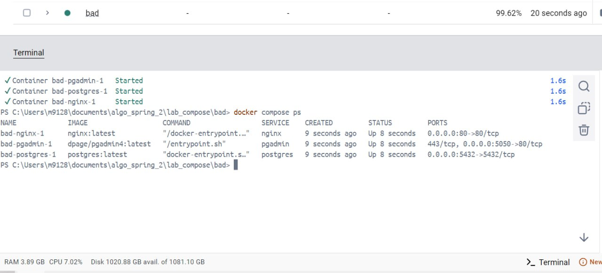
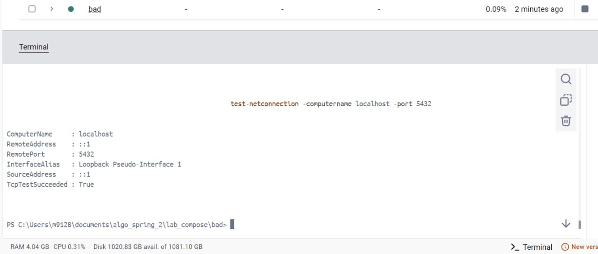
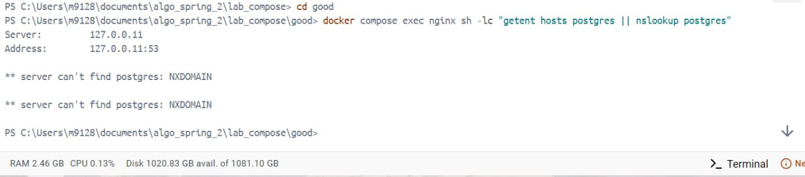
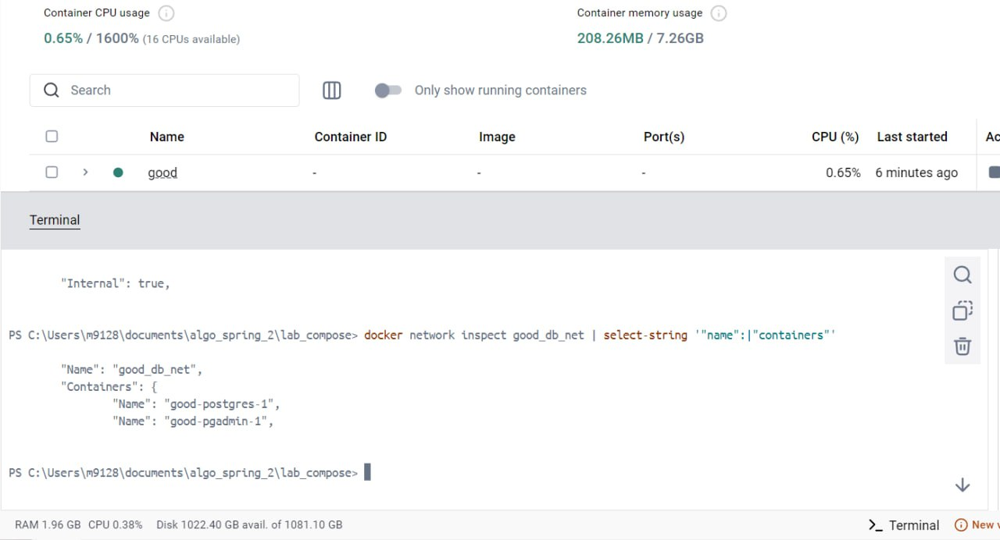
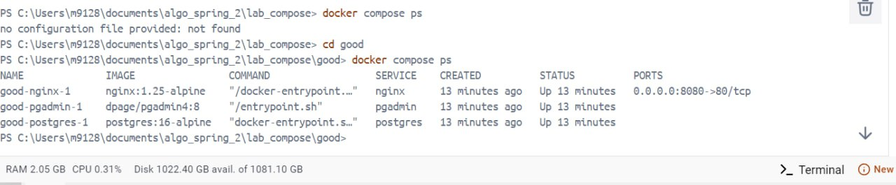
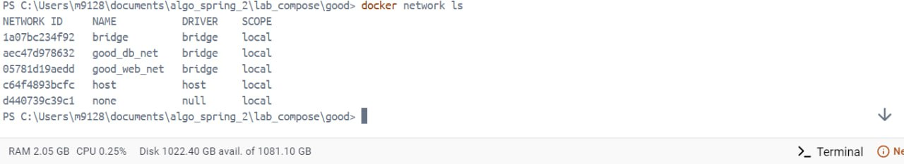

# Анализ конфигурации Docker Compose

## Используемые сервисы
- nginx
- postgres  
- pgadmin

## Плохая практика Docker Compose

**Критические проблемы:**
- Использование версий `latest` - нестабильность при обновлениях
- Логины и пароли БД в открытом виде в YML-файле - риск утечек через Git
- `privileged: true` для nginx - root-доступ к хосту, критично для безопасности

## Хорошая практика Docker Compose

**Улучшения:**
- Фиксированные версии образов - стабильность при обновлениях
- Логины и пароли вынесены в конфиг с `.gitignore` - защита важных данных
- Полное отсутствие root-доступа контейнеров к хосту

## Сетевая изоляция

**Реализованная архитектура:**
- Отдельные мостовые сети для nginx и postgres+pgadmin
- Postgres и pgadmin разделяют общую сеть (видят друг друга)
- nginx изолирован от других сервисов
- Параметр `internal: true` у dbnet блокирует обход изоляции через хост
- Порт 5432 не опубликован - БД доступна только внутри сети контейнеров

## Сравнение результатов

### Плохой docker-compose

- Все порты открыты наружу


- Порт 5432 доступен с хоста - внешний доступ к БД
  

- Отсутствие изоляции: nginx видит IP postgres

### Хороший docker-compose


- Попытка доступа между разными сетями - изоляция работает


- В сети БД только 2 соседа (postgres+pgadmin), nginx отсутствует


- Порт postgres скрыт

```
- Подтверждение работы изоляции
  

- Попытка хитрого подключения к сети БД извне - отказ
